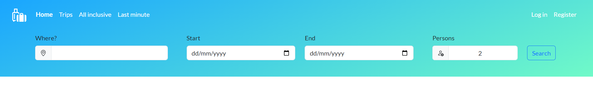

# Travel with us 


## Table of Contents
* [General Info](#general-info)
* [Website with Project](#website-with-project)
* [Tech Stack](#tech-stack)
* [Collaboration and Project Management](#collaboration-and-project-management)
* [Run Localy](#run-locally)
* [Environment Variables](#environment-variables)
* [Features](#features)
* [Used Libraries with Examples](#used-libraries-with-examples)
* [React Technology Implementation with Examples](#react-technology-implementation-with-examples)
* [Licenses](#licenses)


## General Info
This project is a website dedicated to travel agency clients, offering a simple and intuitive interface for browsing and booking tours.
The site is managed by an administrator who has access to a special panel after logging in. The administrator has the ability to add, edit, and delete tour offers.
Customers have access to the full list of offers made available by the administrator. To facilitate the search for the ideal tour, the site offers advanced filtering that can be customized to individual preferences.
After registering on the site and logging in, the user gains access to their personal user panel. In this panel, the user can review their reservations and manage their login data.


## Website with Project
```
https://travel-with-us-wk-de30e4ad117f.herokuapp.com/
```


## Tech Stack
**Frontend:** Rendered with EJS templates, Bootstrap 5.3.2

**Backend:** Node.js (18.16.0) with Express.js (4.18.2), hosted on Heroku

**Database:** MongoDB with Mongoose (7.6.0) 


## Collaboration and Project Management
During the project, two GitHub accounts were used to simulate group work. The main assumption of this approach was to practice sending pull requests, updating branches and resolving conflicts.


## Run Locally
Clone the project  
```bash
  git clone https://github.com/WojciechK92/travel-with-us.git
```
Go to the project directory
```bash
  cd travel-with-us
```
Install dependencies
```bash
  npm install
```
Start the server
```bash
  npm run start
```


## Environment Variables
To run this project, you need to add the following environment variables to your .env file: 
- PORT
- DATABASE
- SESSION_KEY_SECRET


## Features
1. Responsiveness  
The website is fully responsive. You can use it on a mobile device and a PC.

2. Authentication  
- Administrator  
To log in as an administrator, visit the “/login/admin” page. For security reasons, I do not publicly provide login details.


As an administrator, you have full access to browse, add, edit and delete tour offers.


- User   
User authentication consists of the registration, login and profile update pages. 
All forms include email and password validation. 


3. Home page  
On the home page, you have the ability to initially filter tour offers clicking on the tiles that represent the most interesting places to visit. This action will direct you to a page with a list of tours.


4. Search bar  
The header of each page with travel offers features a search bar that allows for basic filtering of trips. This search functionality scans through the entire collection of trips and displays the results based on the filtered fields. This allows users to quickly and efficiently find trips that match their preferences.




5. Filtration and pagination    
For more precise searching of offers, users can use the filtering tab. Users can filter trips based on numerous values depending on their needs.
The site also includes pagination, which displays 4 offers per page, highlights the current page, and allows for smooth transitions to subsequent pages.


6. User panel    
After registering and logging in on the site, the user gains access to their personal user panel. In this panel, the user has the ability to:
- reserve two tours of their choice
- browse and edit the list of reserved tours


## Used Libraries with Examples
1. Bootstrap
- [views/partials/html-header.ejs](https://github.com/WojciechK92/travel-with-us/blob/d094f6f4e6dbe800cf7557568b587c0229b96895/views/partials/html-header.ejs)
- [views/pages/trips/trip.ejs](https://github.com/WojciechK92/travel-with-us/blob/d094f6f4e6dbe800cf7557568b587c0229b96895/views/pages/trips/trip.ejs)

2. Express 
- [app/app.js](https://github.com/WojciechK92/travel-with-us/blob/d094f6f4e6dbe800cf7557568b587c0229b96895/app/app.js)
- [app/routes/web.js](https://github.com/WojciechK92/travel-with-us/blob/d094f6f4e6dbe800cf7557568b587c0229b96895/app/routes/web.js)

3. Ejs and express-ejs-layouts 
- [app/app.js](https://github.com/WojciechK92/travel-with-us/blob/d094f6f4e6dbe800cf7557568b587c0229b96895/app/app.js)
- [views/pages/auth/authForm.ejs](https://github.com/WojciechK92/travel-with-us/blob/d094f6f4e6dbe800cf7557568b587c0229b96895/views/pages/auth/authForm.ejs)
- [views/layouts/main.ejs](https://github.com/WojciechK92/travel-with-us/blob/d094f6f4e6dbe800cf7557568b587c0229b96895/views/layouts/main.ejs)

4. Dotenv 
- [app/config.js](https://github.com/WojciechK92/travel-with-us/blob/d094f6f4e6dbe800cf7557568b587c0229b96895/app/config.js)

5. Mongoose 
- [app/db/models/trip.js](https://github.com/WojciechK92/travel-with-us/blob/d094f6f4e6dbe800cf7557568b587c0229b96895/app/db/models/trip.js)
- [app/db/controllers/trip-controller.js](https://github.com/WojciechK92/travel-with-us/blob/d094f6f4e6dbe800cf7557568b587c0229b96895/app/controllers/trip-controller.js)

6. Cookie Parser 
- [app/config.js](https://github.com/WojciechK92/travel-with-us/blob/d094f6f4e6dbe800cf7557568b587c0229b96895/app/config.js)

7. Express session 
- [app/config.js](https://github.com/WojciechK92/travel-with-us/blob/d094f6f4e6dbe800cf7557568b587c0229b96895/app/config.js)
- [app/controllers/user-controller.js](https://github.com/WojciechK92/travel-with-us/blob/d094f6f4e6dbe800cf7557568b587c0229b96895/app/controllers/user-controller.js)

8. Bcrypt 
- [app/db/models/user.js](https://github.com/WojciechK92/travel-with-us/blob/d094f6f4e6dbe800cf7557568b587c0229b96895/app/db/models/user.js)

9. Multer 
- [app/routes/web.js](https://github.com/WojciechK92/travel-with-us/blob/d094f6f4e6dbe800cf7557568b587c0229b96895/app/routes/web.js)
- [app/services/uploader.js](https://github.com/WojciechK92/travel-with-us/blob/d094f6f4e6dbe800cf7557568b587c0229b96895/app/services/uploader.js)

10. Helmet 
- [app/app.js](https://github.com/WojciechK92/travel-with-us/blob/d094f6f4e6dbe800cf7557568b587c0229b96895/app/app.js)

11. Rate Limiter Flexible
- [app/app.js](https://github.com/WojciechK92/travel-with-us/blob/d094f6f4e6dbe800cf7557568b587c0229b96895/app/app.js)
- [app/middleware/rate-limiter-middleware.js](https://github.com/WojciechK92/travel-with-us/blob/d094f6f4e6dbe800cf7557568b587c0229b96895/app/middleware/rate-limiter-middleware.js)

12. Core modules - fs, path
- [app/controllers/admin-controller.js](https://github.com/WojciechK92/travel-with-us/blob/d094f6f4e6dbe800cf7557568b587c0229b96895/app/controllers/admin-controller.js)
- [app/app.js](https://github.com/WojciechK92/travel-with-us/blob/d094f6f4e6dbe800cf7557568b587c0229b96895/app/app.js)

13. Nodemon


## Node Technology Implementation with Examples
1. Modules - commonJS and ESModules (The application was created using the ESModule) 
- [app/app.js](https://github.com/WojciechK92/travel-with-us/blob/d094f6f4e6dbe800cf7557568b587c0229b96895/app/app.js)

2. Middleware
- [app/middleware/view-variables-middleware.js](https://github.com/WojciechK92/travel-with-us/blob/d094f6f4e6dbe800cf7557568b587c0229b96895/app/middleware/view-variables-middleware.js)

3. Public folder (express.static('public'))
- [app/app.js](https://github.com/WojciechK92/travel-with-us/blob/d094f6f4e6dbe800cf7557568b587c0229b96895/app/app.js)

4. Body parsers (express.urlencoded(), express.json()) 
- [app/app.js](https://github.com/WojciechK92/travel-with-us/blob/d094f6f4e6dbe800cf7557568b587c0229b96895/app/app.js)

5. Routes 
- [app/routes/web.js](https://github.com/WojciechK92/travel-with-us/blob/d094f6f4e6dbe800cf7557568b587c0229b96895/app/routes/web.js)

6. Controllers
- [app/constollers/page-controller.js](https://github.com/WojciechK92/travel-with-us/blob/d094f6f4e6dbe800cf7557568b587c0229b96895/app/controllers/page-controller.js)

7. Services 
- [app/services/filtration.js](https://github.com/WojciechK92/travel-with-us/blob/d094f6f4e6dbe800cf7557568b587c0229b96895/app/services/filtration.js)


## Licenses
1. Photos  
The photos used in this project come from one source. Photos shared there can be freely published:
- [Unsplash](https://unsplash.com)

2. Access to the data  
I would like to provide recruiters with free access to data in this project. Please remember that any information contained in this project is intended for recruitment purposes only and should not be used in any other way without my express consent.

